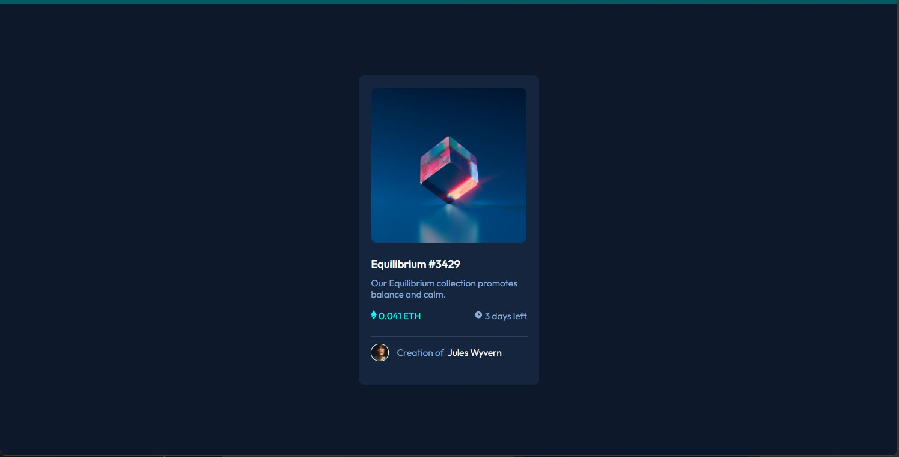

# Frontend Mentor - NFT preview card component Solution

**This is a solution to the [QR code component challenge on Frontend Mentor](https://www.frontendmentor.io/challenges/qr-code-component-iux_sIO_H). Frontend Mentor challenges help you improve your coding skills by building realistic projects. 
**
## Table of contents

- [Frontend Mentor - NFT preview card component Solution](#frontend-mentor---nft-preview-card-component-solution)
  - [Table of contents](#table-of-contents)
  - [Overview](#overview)
    - [The challenge](#the-challenge)
    - [Screenshots](#screenshots)
      - [Desktop](#desktop)
      - [Mobile](#mobile)
    - [Links](#links)
    - [Built with](#built-with)
  - [Acknowledgments](#acknowledgments)
  - [Author](#author)

## Overview

This is one of the solutions with the amount of css I know. I would'nt say the this is a hack for the solution. But this is a good hack. 

### The challenge

Users should be able to:

- View the optimal layout depending on their device's screen size
- See hover states for interactive elements

### Screenshots

#### Desktop

---

#### Mobile

---

### Links

- Solution URL: [Github Repository](https://github.com/bene-volent/nft-preview-component)
- Live Site URL: [Github Page](https://bene-volent.github.io/nft-preview-component)

### Built with

- Semantic HTML5 markup
- CSS custom properties
- Flexbox
- CSS Grid
- Mobile-first workflow

## Acknowledgments

In order to create the overlay, I took "Reference" from [@correlucas](https://www.frontendmentor.io/solutions/nft-preview-card-vanilla-css-custom-design-and-hover-effects-zVKSAE5IXI) solution. Without this, I couldn't have created this.

## Author

- Frontend Mentor - [@Benevolent](https://www.frontendmentor.io/profile/bene-volent)
- Twitter - [@Benevolent](https://twitter.com/bene_volent_)
